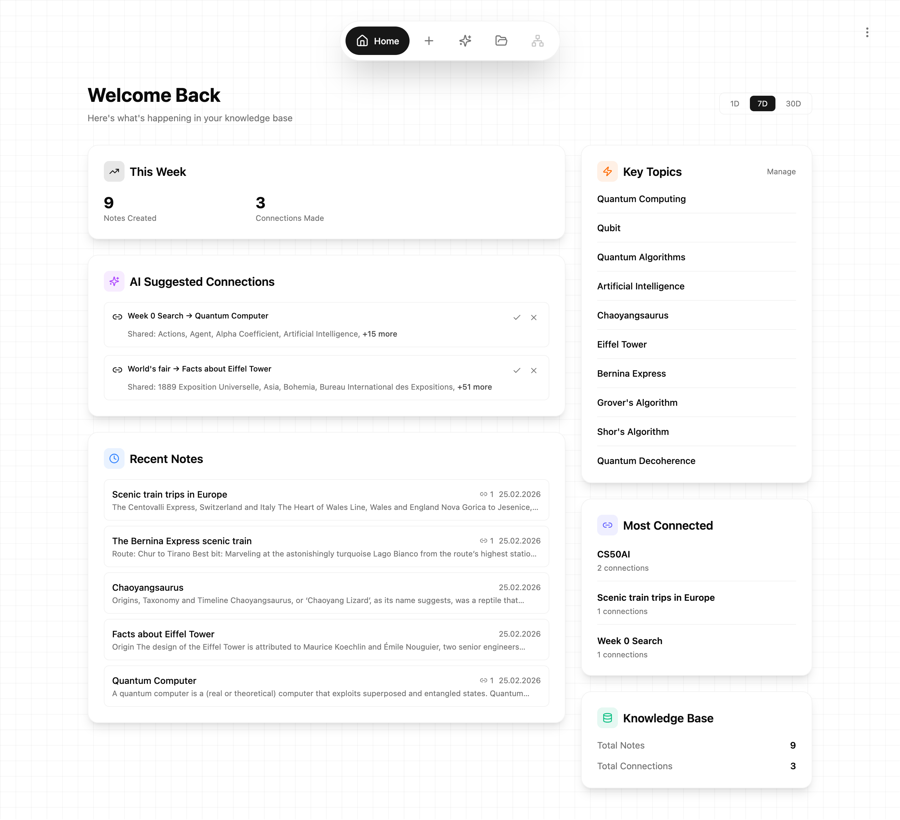
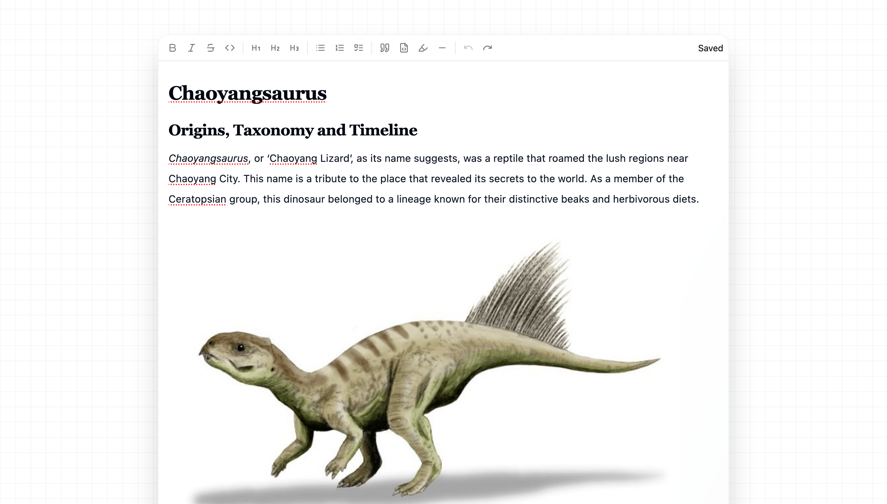
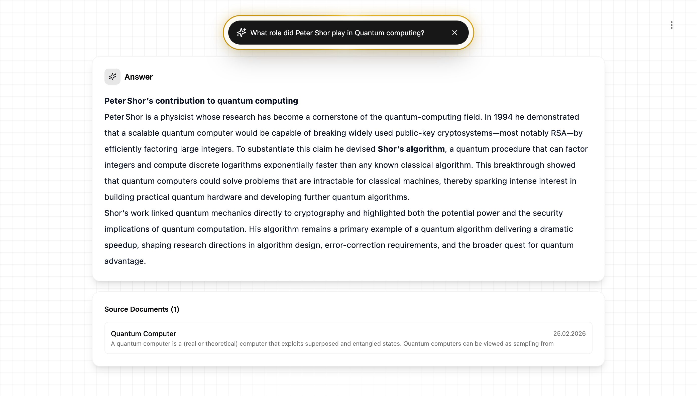
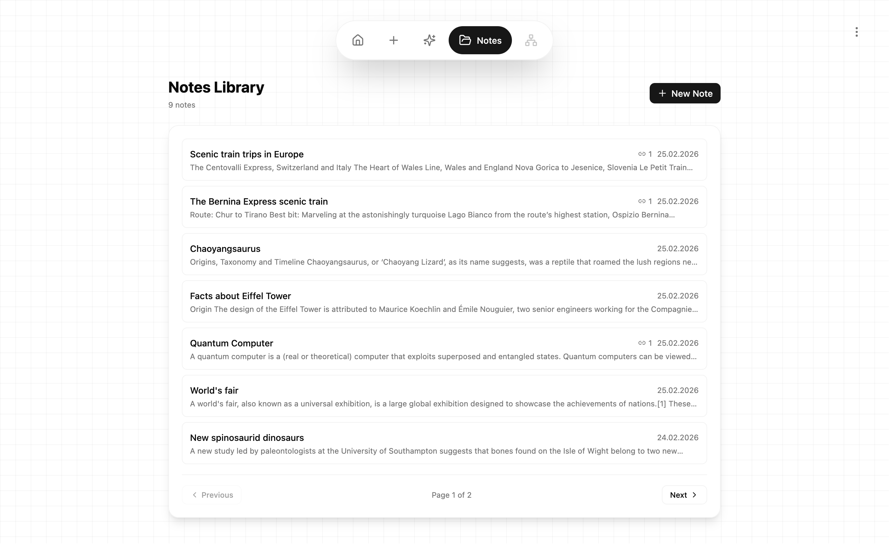
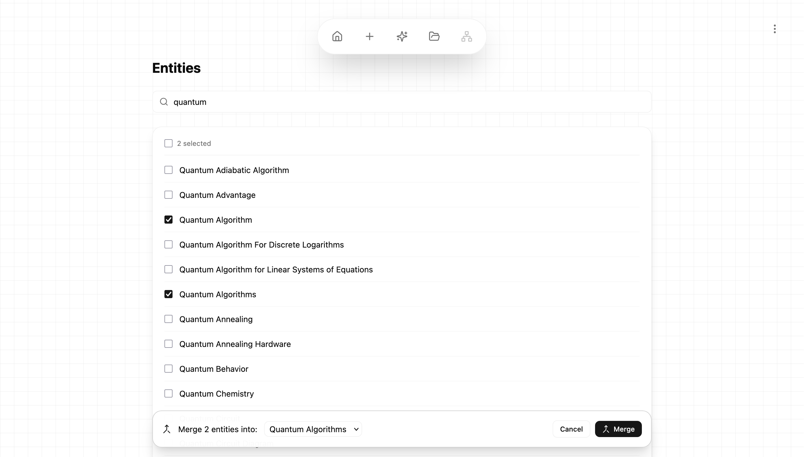
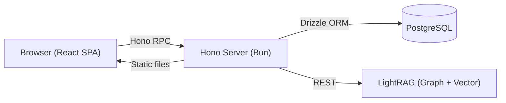

<h1 align="center">Cogninote</h1>

<h3 align="center">
  AI-First Personal Knowledge Base
</h3>

<p align="center">Take notes. Ask questions in plain language. Let the AI discover connections and insights.</p>

<br/>



<p align="center">
  <sub>Self-hosted via Docker. Bring Your Own Key — works with Claude, Gemini, OpenAI, llama.cpp, LM Studio, and more.</sub>
</p>

## Features

<details>

<summary>Rich text editor — Markdown-based, powered by Tiptap.</summary>



</details>

<details>

<summary>Ask questions, get grounded answers — natural language queries answered by your own notes via LightRAG (hybrid knowledge graph + vector retrieval).</summary>



</details>

<details>

<summary>Dashboard — stats, recent notes, top entities from your knowledge graph, and link suggestions for notes that share the same concepts.</summary>


</details>

<details>

<summary>Notes library — browse, search, and manage all your notes in one place.</summary>



</details>

<details>

<summary>Entity explorer — view and manage AI-extracted topics and entities from your knowledge graph. </summary>



</details>

## Quick Start

```bash
cp .env.lightrag.example .env.lightrag
docker compose up -d
open http://localhost:3000
```

Configure your LLM provider in `.env.lightrag` (defaults to Gemini API). LightRAG requires LLM and embedding models for document indexing and querying.
See [LightRAG Server docs](https://github.com/HKUDS/LightRAG/blob/main/lightrag/api/README.md#before-starting-lightrag-server) for details.

### LightRAG Server Web UI

Access LightRAG's Web UI at [http://localhost:8020](http://localhost:8020) for document indexing status, bulk import, and knowledge graph exploration.

## Architecture



Cogninote is a **monorepo** (`apps/api` + `apps/web`) where a single Hono process serves both the REST API and the built React SPA.

**RAG pipeline:** When a note is saved it gets indexed into LightRAG as a Markdown document. On query, LightRAG performs hybrid retrieval (knowledge graph traversal + vector similarity) for contextually relevant, grounded responses.

**End-to-end type safety:** The API exports its Hono route types directly. The frontend gets fully typed API calls via `hc` (Hono RPC). The LightRAG client is generated from its OpenAPI spec using `openapi-typescript` and `openapi-fetch`.

**Scheduler:** Background scheduler handles suggestion generation, index reconciliation, and cache cleanup

## Tech Stack

| Layer | Choice | Why |
|---|---|---|
| Runtime | **Bun** | Fast startup, native TypeScript, built-in workspace support |
| Backend | **Hono** | Lightweight, runs anywhere, serves both API and SPA from one process |
| Frontend | **React + TanStack Router + TanStack Query** | File-based type-safe routing, efficient server state and data fetching |
| Client state | **Zustand** | Minimal boilerplate for editor save state and UI toggles |
| Editor | **Tiptap** | Extensible rich text with bidirectional Markdown serialization |
| ORM | **Drizzle** | Type-safe SQL, schema-as-code |
| Database | **PostgreSQL 15** | Reliable, fast database |
| Auth | **Better Auth** | Session-based auth with Drizzle adapter, no external service |
| Validation | **Valibot** | Lightweight schema validation integrated with Hono middleware |
| RAG | **LightRAG** | Hybrid graph + vector retrieval — better contextual answers than pure vector search |
| Styling | **Tailwind CSS** | Utility-first, custom CSS variables for theming |
| Linting | **Biome** | Single tool for formatting + linting, fast |

## Development

```bash
# Prerequisites: Bun, Docker

bun install                             # Install dependencies
docker compose up -d db lightrag        # Start PostgreSQL + LightRAG
cp apps/api/.env.example apps/api/.env  # Configure backend environment
cp apps/web/.env.example apps/web/.env  # Configure frontend environment

bun run dev  # Starts both dev servers — Web on :3000, API on :3001
```

## Project Structure

```
cogninote/
├── apps/
│   ├── api/                  # Hono backend
│   │   ├── src/
│   │   │   ├── routes/       # HTTP handlers + validation
│   │   │   ├── services/     # Business logic + LightRAG integration
│   │   │   ├── db/           # Drizzle schema + connection
│   │   │   └── lib/          # Auth config, middleware
│   │   └── package.json
│   └── web/                  # React SPA
│       ├── src/
│       │   ├── routes/       # TanStack file-based routes
│       │   ├── components/   # UI components
│       │   ├── hooks/        # useAutosave, etc.
│       │   ├── stores/       # Zustand stores
│       │   └── lib/          # API client, utilities
│       └── package.json
├── docker-compose.yml
├── Dockerfile                # Multi-stage (build + runtime) for api & web apps
└── biome.json                # Shared linter config
```
